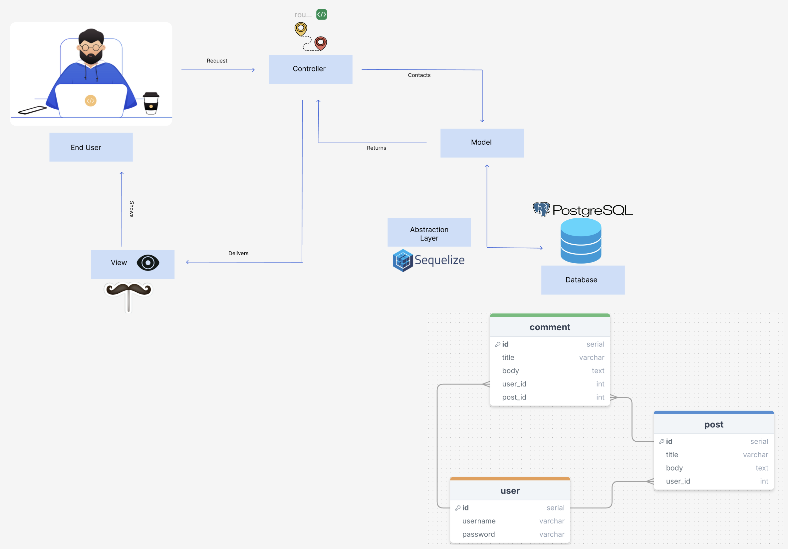

# MVC Tech Blog

This is a full-stack, MVC-structured tech blog application that enables users to create, edit, and comment on blog posts. Designed with a RESTful architecture, it features a robust backend and interactive front end, leveraging the following technologies:

- **Sequelize** as an ORM for **PostgreSQL** database interactions
- **Express.js** for routing and middleware
- **Express-Session** for secure user authentication and session management
- **Handlebars.js** as the templating engine for dynamic view rendering
- **Bootstrap** for responsive, modern UI styling

### Features



- **User Authentication**: Secure user signup, login, and session-based access control.
- **Blog Post Management**: Users can create, edit, and delete posts, with data saved in PostgreSQL.
- **Commenting System**: Authenticated users can comment on posts, promoting interaction.
- **MVC Structure**: Organized with Sequelize models, controller-based routes, and Handlebars views for scalability and maintainability.

## User Story

```md
AS A developer who writes about tech
I WANT a CMS-style blog site
SO THAT I can publish articles, blog posts, and my thoughts and opinions
```

### Installation

1. Clone the repository and navigate to the project directory.

2. Install dependencies with:

```bash
npm install
```

3. Configure environment variables and database setup in a .env file.

4. Run the seed files with:

```bash
npm run seed
```

5. Start the server with:

```bash
npm start
```
